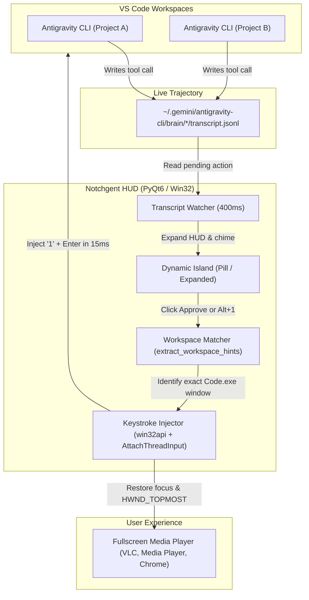

# Notchgent

> **Always-on-Top "Dynamic Island" HUD for Antigravity & VS Code on Windows.**  
> Watch movies, streams, or focus on other apps in fullscreen while Antigravity agents code in the background. Review and approve pending commands with 1 click or a global hotkey—**without Alt-Tabbing, without window focus popups, and without video interruptions.**

---

## Highlights

- **Fullscreen Overlay Persistence**: Floats permanently on top of fullscreen video players (Windows Media Player, VLC, MPC-HC, Chrome, Netflix, etc.) via continuous `HWND_TOPMOST` re-assertion that bypasses Windows DWM fullscreen suppression.
- **Zero Video Interruption**: Approving an action briefly shifts focus in the background for ~15ms via native Win32 `keybd_event`, then **instantly pins your fullscreen movie player back on top**. VS Code never pops up or covers your movie.
- **Dynamic Multi-Workspace Routing**: If you have multiple VS Code windows open across different projects (e.g. `TTS`, `FFTL-light-astro-theme`, `notchgent`), Notchgent inspects the pending tool call's working directory (`Cwd`), target file, and active `agy.exe` environment to **dynamically target the exact VS Code window where that agent is running**.
- **Workspace Identifier**: The island header displays the active workspace name (e.g. `Approval Needed • TTS`), so you always know which project needs your input.
- **15-Minute Auto Mode**: Optional 15-minute countdown timer that auto-approves pending actions after a soft chime, allowing hands-free operation.
- **Zero-Hook Architecture**: Runs against stock Antigravity CLI without modifying `hooks.json` or intercepting terminal streams. It observes live JSONL transcripts directly.
- **Universal Global Hotkeys**: Approve with <kbd>Alt</kbd>+<kbd>1</kbd>, <kbd>Alt</kbd>+<kbd>A</kbd>, or <kbd>F8</kbd>. Reject with <kbd>Alt</kbd>+<kbd>2</kbd>, <kbd>Alt</kbd>+<kbd>D</kbd>, or <kbd>F9</kbd>.
- **Auto Re-minimization**: If VS Code was minimized to the taskbar, it receives the approval keystroke and is immediately tucked back into the taskbar (`SW_MINIMIZE`).

---

## Architecture



---

## Global Hotkeys and Controls

| Action | On-Screen Control | Global Hotkeys |
| :--- | :--- | :--- |
| **Approve Action** | Click `[ ✓ 1. Approve (Alt+1) ]` | <kbd>Alt</kbd>+<kbd>1</kbd>, <kbd>Alt</kbd>+<kbd>A</kbd>, <kbd>F8</kbd> |
| **Reject Action** | Click `[ ✕ 2 (Alt+2) ]` | <kbd>Alt</kbd>+<kbd>2</kbd>, <kbd>Alt</kbd>+<kbd>D</kbd>, <kbd>F9</kbd> |
| **Toggle Auto Mode** | Click `[ 🎬 Auto ]` / `[ 🎬 14:59 ]` | Click button on capsule |
| **Move Notch** | Click and drag the capsule | Mouse drag |
| **Close HUD** | Click `[ ✕ ]` | Click button on capsule |

---

## Getting Started

### Prerequisites

- Windows 10 or 11
- Python 3.10+ (with `PyQt6`, `pywin32`, `psutil`, `pynput`, `pyautogui`)

```bash
pip install PyQt6 pywin32 psutil pynput pyautogui
```

### Launching Notchgent

- **Standalone Release Executable**: Run [`dist\Notchgent.exe`](file:///C:/Users/Administrator/Documents/TECH/notchgent/dist/Notchgent.exe) directly without requiring Python or dependencies installed.
- **Start Script**: Double-click [`start.bat`](file:///C:/Users/Administrator/Documents/TECH/notchgent/start.bat) (launches `dist\Notchgent.exe` if present, or falls back to `pythonw notchgent.py`).
- **Restart / Reload Code**: Double-click [`restart.bat`](file:///C:/Users/Administrator/Documents/TECH/notchgent/restart.bat). It cleanly terminates the previous instance via [`.notchgent.pid`](file:///C:/Users/Administrator/Documents/TECH/notchgent/.notchgent.pid) and boots the updated HUD.
- **Stop**: Double-click [`stop.bat`](file:///C:/Users/Administrator/Documents/TECH/notchgent/stop.bat).

### Building a Standalone Release (.exe)

To compile a single, zero-dependency release `.exe`:

1. Run [`build.bat`](file:///C:/Users/Administrator/Documents/TECH/notchgent/build.bat) (or `python -m PyInstaller Notchgent.spec`).
2. The bundled binary will be produced at [`dist\Notchgent.exe`](file:///C:/Users/Administrator/Documents/TECH/notchgent/dist/Notchgent.exe) with embedded high-resolution icons, Qt6 runtimes, and Win32 hooks.

---

## Project Structure

```text
notchgent/
├── dist/
│   └── Notchgent.exe   # Compiled standalone release binary (zero dependencies)
├── notchgent.py        # Main application: PyQt6 HUD, Win32 window manager & transcript watcher
├── make_icon.py        # High-res multi-resolution icon generator
├── app_icon.ico        # Application and taskbar icon (256x256 down to 16x16)
├── build.bat           # PyInstaller release build script
├── start.bat           # Quick launcher (prefers compiled exe)
├── restart.bat         # Process-safe restart script (reads .notchgent.pid)
├── stop.bat            # Graceful termination script
├── .notchgent.pid      # Single-instance process ID tracking file
├── config.json         # User configuration settings (geometry, hotkeys, opacity)
└── README.md           # Project documentation
```

---

## Windows Fullscreen and Focus Protection Mechanics

1. **Focus Stealing Bypass**: Standard Windows API calls to `SetForegroundWindow` are normally blocked by Windows security (`LockSetForegroundWindow`) when invoked from a background thread. Notchgent uses Win32 `AttachThreadInput` combined with a simulated <kbd>Alt</kbd> key event to safely acquire foreground rights, inject the approval keystrokes into the designated terminal, and release focus back to the movie window in under 15ms.
2. **DirectFlip / MPO Bypass**: Windows 11 Media Player and modern browsers use DirectFlip / Multi-Plane Overlays when entering fullscreen, which normally causes DWM to hide tool windows. Notchgent periodically re-asserts `HWND_TOPMOST` with `SWP_NOACTIVATE`, keeping the island visible without interrupting video playback or stealing keyboard focus from your media player.
